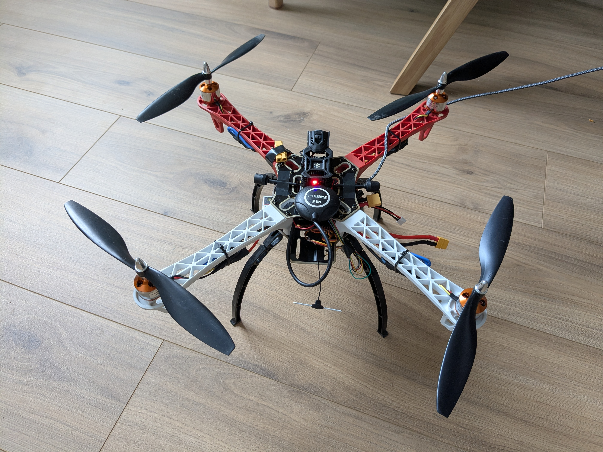
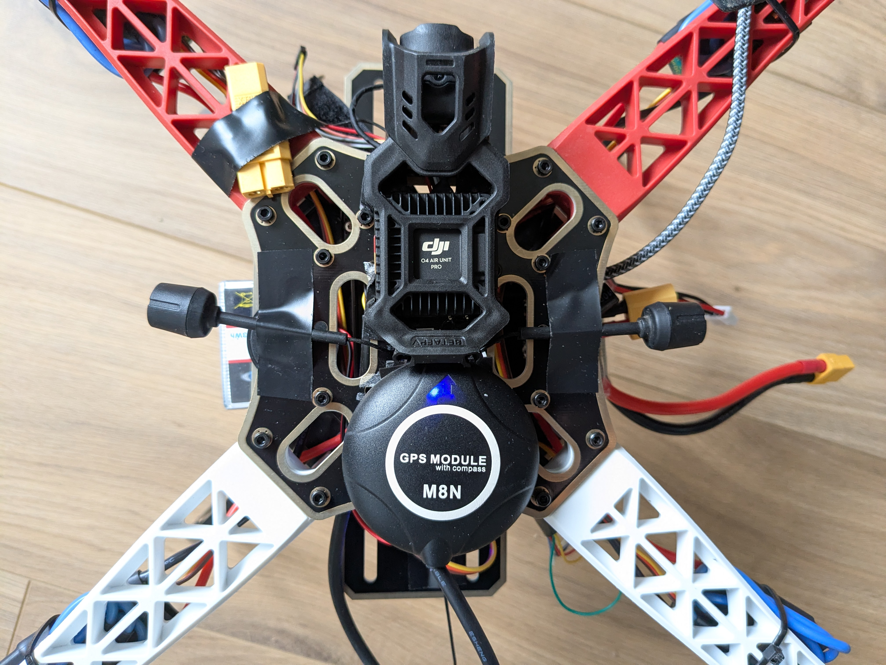
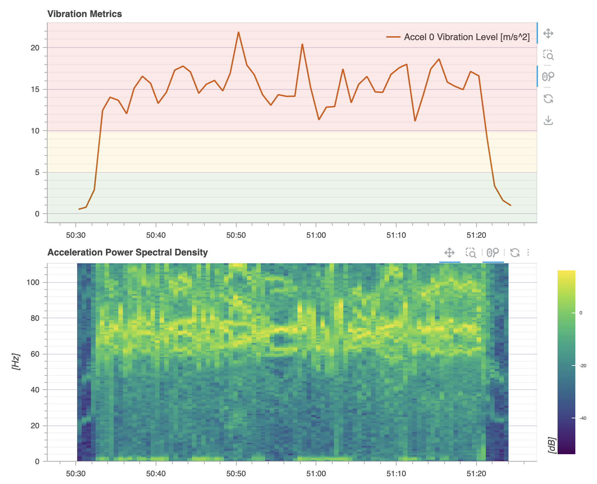

# f450 drone

[YouTube video](https://www.youtube.com/watch?v=wl-joPCPmnE)

<p>
  <em>F450</em></br>
  
</p>

<p>
  <em>F450</em></br>
  
</p>

## Hardware

- [QWinOut F450 frame](https://www.amazon.fr/dp/B08GX5Z4SN?ref_=ppx_hzsearch_conn_dt_b_fed_asin_title_1)
- Width: 450mm
- Height: 55mm
- 1000KV Brushless Motors
- 10-inches propellers
- 3S 3300mAh LiPo battery
- [Pixhawk 2.4.8](https://www.amazon.fr/dp/B08B83JKP7?ref_=ppx_hzsearch_conn_dt_b_fed_asin_title_2) flight controller running PX4
- [Dampers](https://www.amazon.fr/dp/B0CLXHSYSL?ref=ppx_yo2ov_dt_b_fed_asin_title&th=1) for the FC
- [M8N module](https://fr.aliexpress.com/item/1005008493509634.html?spm=a2g0o.order_list.order_list_main.35.26fe5e5b9S8z77&gatewayAdapt=glo2fra) with magnetometer (--> I2C)
- Buzzer
- [Beta FPV ELRS 2.4GHz receiver](https://betafpv.com/products/elrs-nano-receiver?variant=40838513819782)
- RadioMaster Zorro with ELRS
- DJI O4 Pro Air Unit powered by a 2S battery (no telemetry)
- DJI Goggles N3

## Performances

- PX4 modes : ALTITUDE, POSITION, MISSION, etc
- Flight duration : 7-8 minutes
- Frame + electronics weight : 722g
- Battery weight : 278g
- DJI Air unit + 2S battery weight : 157g
- Total weight : 1157g
- No optical flow stabilization

## PX4 build

Clone the PX4 Autopilot repo :

```
git clone https://github.com/PX4/PX4-Autopilot.git
cd PX4-Autopilot
git submodule update --init --recursive
```

Build px4 software for Pixhawk 2.4.8 with CRSF support.

Check [default.px4board](default.px4board)

```
CONFIG_DRIVERS_RC_CRSF_RC=y
```

```
make px4_fmu-v3_default
```

Then upload your [build/px4_fmu-v3_default/px4_fmu-v3_default.px4](px4_fmu-v3_default.px4) to the flight controller via QGroundControl.

or

```
~/PX4-Autopilot$ make px4_fmu-v3_default upload
[0/1] uploading px4
==========================================================================================================
WARNING: You should uninstall ModemManager as it conflicts with any non-modem serial device (like Pixhawk)
==========================================================================================================
Waiting for bootloader...
Attempting reboot on /dev/serial/by-id/usb-3D_Robotics_PX4_BL_FMU_v2.x_0-if00 with baudrate=57600...
If the board does not respond, unplug and re-plug the USB connector.

Found board id: 9,0 bootloader protocol revision 5 on /dev/serial/by-id/usb-3D_Robotics_PX4_BL_FMU_v2.x_0-if00
Loaded firmware for board id: 9,0 size: 2026140 bytes (97.37%)

Bootloader version: unknown
Sn: 002f00333533510c37323830
Chip: 20036419
Family: STM32F42x
Revision: ?
Flash: 2080768 bytes
Windowed mode: False

Erase  : [====================] 100.0%
Program: [====================] 100.0%
Verify : [====================] 100.0%
Rebooting. Elapsed Time 15.223
```

If you need to change something in the config, open the NuttX menu :

```
make px4_fmu-v3_default menuconfig
```

## PX4 params

See [f450.params](f450.params)

### ELRS

Enable ELRS/CRSF on Telem2 (for example)

```
RC_CRSF_PRT_CFG = TELEM 2
RC_CRSF_TEL_EN = Enabled
```

### Music sound via buzzer

I could not find a way to change the music sound of the ESC, this is why I used the buzzer than you can easily connect to the PixHawk.

To have the Mario theme, write a file in the SD card of Pixhawk

`etc/extras.txt` :

```
tune_control stop
sleep(0.5)
tune_control play -m MFT150e6e6e5c10e4g6
```

## Rates tuning

Default parameters creates a very safe and sloppy control, I wanted something more reactive in thrust :

```
MPC_ACC_UP_MAX 6.0
MPC_LAND_SPEED 2.5
MPC_TKO_SPEED 3.0
MPC_Z_VEL_ALL 5.0
MPC_Z_P 1.40
MPC_Z_VEL_MAX_DN 3.8
MPC_Z_VEL_MAX_UP 5.0
MPC_W_VEL_P_ACC 6.0
MPC_Z_V_AUTO_DN 3.8
MPC_Z_V_AUTO_UP 5.0
```

I didnt change the attitude rates, they were just fine.

Dont forget to calibrate the gyroscope, accelerometer and compass via QGC before flying.

## RC binding

If you have an ELRS RC (like Radiomaster Zorro), binding to the ELRS receiver is seamless. Use QGC to assign flight modes, arm and kill switches. Calibrate your ESCs and the RC input sticks.

## Vibrations

Despite high vibrations, I find the drone quite stable and easy to pilot.

<p>
  <em>Flight review logs</em></br>
  
</p>

I just regretted that the Pixhawk 2.4.8 is too big compared to the place I have on the F450 frame, I would have added proper rubbers to reduce the vibration level...
